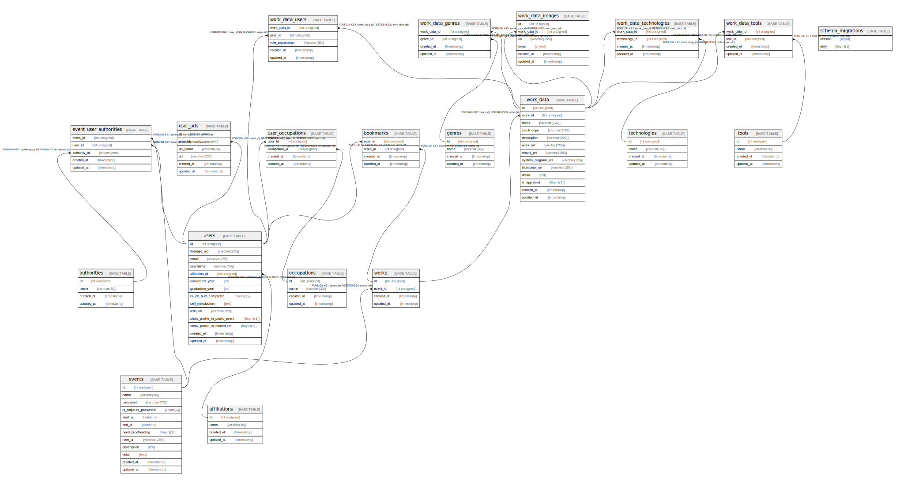

# evork

## Tables

| Name | Columns | Comment | Type |
| ---- | ------- | ------- | ---- |
| [affiliations](affiliations.md) | 4 |  | BASE TABLE |
| [authorities](authorities.md) | 4 |  | BASE TABLE |
| [bookmarks](bookmarks.md) | 4 |  | BASE TABLE |
| [event_user_authorities](event_user_authorities.md) | 5 |  | BASE TABLE |
| [events](events.md) | 12 |  | BASE TABLE |
| [genres](genres.md) | 4 |  | BASE TABLE |
| [occupations](occupations.md) | 4 |  | BASE TABLE |
| [schema_migrations](schema_migrations.md) | 2 |  | BASE TABLE |
| [technologies](technologies.md) | 4 |  | BASE TABLE |
| [tools](tools.md) | 4 |  | BASE TABLE |
| [user_occupations](user_occupations.md) | 4 |  | BASE TABLE |
| [user_urls](user_urls.md) | 6 |  | BASE TABLE |
| [users](users.md) | 14 |  | BASE TABLE |
| [work_data](work_data.md) | 13 |  | BASE TABLE |
| [work_data_genres](work_data_genres.md) | 4 |  | BASE TABLE |
| [work_data_images](work_data_images.md) | 6 |  | BASE TABLE |
| [work_data_technologies](work_data_technologies.md) | 4 |  | BASE TABLE |
| [work_data_tools](work_data_tools.md) | 4 |  | BASE TABLE |
| [work_data_users](work_data_users.md) | 5 |  | BASE TABLE |
| [works](works.md) | 4 |  | BASE TABLE |

## Relations

---

> Generated by [tbls](https://github.com/k1LoW/tbls)
