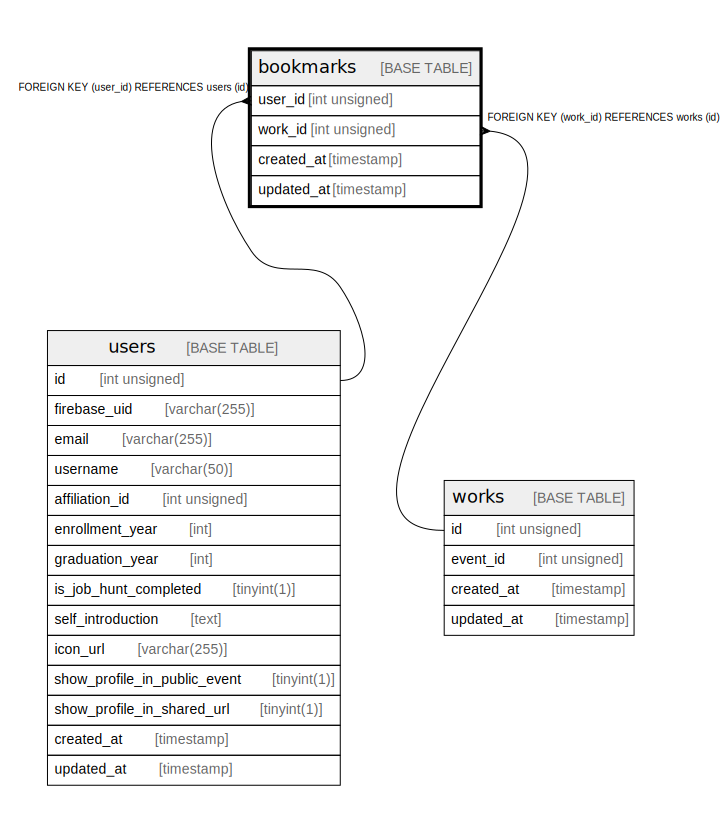

# bookmarks

## Description

<details>
<summary><strong>Table Definition</strong></summary>

```sql
CREATE TABLE `bookmarks` (
  `user_id` int unsigned NOT NULL,
  `work_id` int unsigned NOT NULL,
  `created_at` timestamp NULL DEFAULT CURRENT_TIMESTAMP,
  `updated_at` timestamp NULL DEFAULT CURRENT_TIMESTAMP ON UPDATE CURRENT_TIMESTAMP,
  KEY `Bookmark_user_id_idx` (`user_id`),
  KEY `Bookmark_work_id_idx` (`work_id`),
  CONSTRAINT `Bookmark_user_id_fkey` FOREIGN KEY (`user_id`) REFERENCES `users` (`id`) ON DELETE RESTRICT ON UPDATE CASCADE,
  CONSTRAINT `Bookmark_work_id_fkey` FOREIGN KEY (`work_id`) REFERENCES `works` (`id`) ON DELETE RESTRICT ON UPDATE CASCADE
) ENGINE=InnoDB DEFAULT CHARSET=utf8mb4 COLLATE=utf8mb4_general_ci
```

</details>

## Columns

| Name | Type | Default | Nullable | Extra Definition | Children | Parents | Comment |
| ---- | ---- | ------- | -------- | ---------------- | -------- | ------- | ------- |
| user_id | int unsigned |  | false |  |  | [users](users.md) |  |
| work_id | int unsigned |  | false |  |  | [works](works.md) |  |
| created_at | timestamp | CURRENT_TIMESTAMP | true | DEFAULT_GENERATED |  |  |  |
| updated_at | timestamp | CURRENT_TIMESTAMP | true | DEFAULT_GENERATED on update CURRENT_TIMESTAMP |  |  |  |

## Constraints

| Name | Type | Definition |
| ---- | ---- | ---------- |
| Bookmark_user_id_fkey | FOREIGN KEY | FOREIGN KEY (user_id) REFERENCES users (id) |
| Bookmark_work_id_fkey | FOREIGN KEY | FOREIGN KEY (work_id) REFERENCES works (id) |

## Indexes

| Name | Definition |
| ---- | ---------- |
| Bookmark_user_id_idx | KEY Bookmark_user_id_idx (user_id) USING BTREE |
| Bookmark_work_id_idx | KEY Bookmark_work_id_idx (work_id) USING BTREE |

## Relations



---

> Generated by [tbls](https://github.com/k1LoW/tbls)
