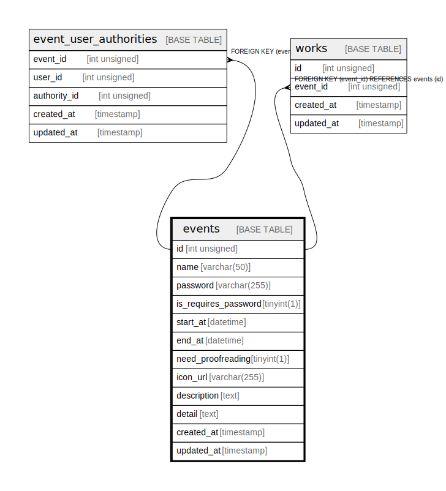

# events

## Description

<details>
<summary><strong>Table Definition</strong></summary>

```sql
CREATE TABLE `events` (
  `id` int unsigned NOT NULL AUTO_INCREMENT,
  `name` varchar(50) COLLATE utf8mb4_general_ci NOT NULL,
  `password` varchar(255) COLLATE utf8mb4_general_ci DEFAULT NULL,
  `is_requires_password` tinyint(1) DEFAULT '0',
  `start_at` datetime DEFAULT NULL,
  `end_at` datetime DEFAULT NULL,
  `need_proofreading` tinyint(1) DEFAULT '0',
  `icon_url` varchar(255) COLLATE utf8mb4_general_ci DEFAULT NULL,
  `description` text COLLATE utf8mb4_general_ci,
  `detail` text COLLATE utf8mb4_general_ci,
  `created_at` timestamp NULL DEFAULT CURRENT_TIMESTAMP,
  `updated_at` timestamp NULL DEFAULT CURRENT_TIMESTAMP ON UPDATE CURRENT_TIMESTAMP,
  PRIMARY KEY (`id`)
) ENGINE=InnoDB DEFAULT CHARSET=utf8mb4 COLLATE=utf8mb4_general_ci
```

</details>

## Columns

| Name | Type | Default | Nullable | Extra Definition | Children | Parents | Comment |
| ---- | ---- | ------- | -------- | ---------------- | -------- | ------- | ------- |
| id | int unsigned |  | false | auto_increment | [event_user_authorities](event_user_authorities.md) [works](works.md) |  |  |
| name | varchar(50) |  | false |  |  |  |  |
| password | varchar(255) |  | true |  |  |  |  |
| is_requires_password | tinyint(1) | 0 | true |  |  |  |  |
| start_at | datetime |  | true |  |  |  |  |
| end_at | datetime |  | true |  |  |  |  |
| need_proofreading | tinyint(1) | 0 | true |  |  |  |  |
| icon_url | varchar(255) |  | true |  |  |  |  |
| description | text |  | true |  |  |  |  |
| detail | text |  | true |  |  |  |  |
| created_at | timestamp | CURRENT_TIMESTAMP | true | DEFAULT_GENERATED |  |  |  |
| updated_at | timestamp | CURRENT_TIMESTAMP | true | DEFAULT_GENERATED on update CURRENT_TIMESTAMP |  |  |  |

## Constraints

| Name | Type | Definition |
| ---- | ---- | ---------- |
| PRIMARY | PRIMARY KEY | PRIMARY KEY (id) |

## Indexes

| Name | Definition |
| ---- | ---------- |
| PRIMARY | PRIMARY KEY (id) USING BTREE |

## Relations



---

> Generated by [tbls](https://github.com/k1LoW/tbls)
