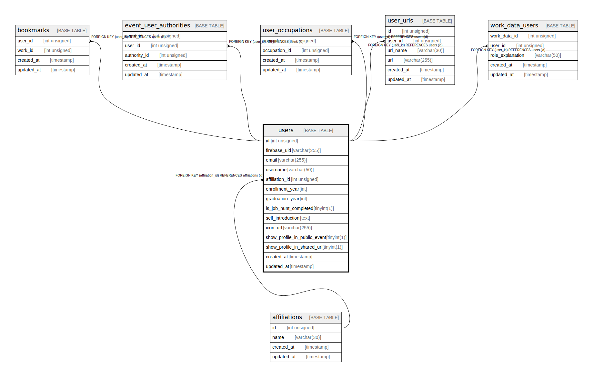

# users

## Description

<details>
<summary><strong>Table Definition</strong></summary>

```sql
CREATE TABLE `users` (
  `id` int unsigned NOT NULL AUTO_INCREMENT,
  `firebase_uid` varchar(255) COLLATE utf8mb4_general_ci NOT NULL,
  `email` varchar(255) COLLATE utf8mb4_general_ci NOT NULL,
  `username` varchar(50) COLLATE utf8mb4_general_ci NOT NULL,
  `affiliation_id` int unsigned DEFAULT NULL,
  `enrollment_year` int DEFAULT NULL,
  `graduation_year` int DEFAULT NULL,
  `is_job_hunt_completed` tinyint(1) DEFAULT '0',
  `self_introduction` text COLLATE utf8mb4_general_ci,
  `icon_url` varchar(255) COLLATE utf8mb4_general_ci DEFAULT NULL,
  `show_profile_in_public_event` tinyint(1) DEFAULT '0',
  `show_profile_in_shared_url` tinyint(1) DEFAULT '0',
  `created_at` timestamp NULL DEFAULT CURRENT_TIMESTAMP,
  `updated_at` timestamp NULL DEFAULT CURRENT_TIMESTAMP ON UPDATE CURRENT_TIMESTAMP,
  PRIMARY KEY (`id`),
  UNIQUE KEY `email` (`email`),
  KEY `User_affiliations_id_fkey` (`affiliation_id`),
  CONSTRAINT `User_affiliations_id_fkey` FOREIGN KEY (`affiliation_id`) REFERENCES `affiliations` (`id`) ON DELETE SET NULL ON UPDATE CASCADE
) ENGINE=InnoDB DEFAULT CHARSET=utf8mb4 COLLATE=utf8mb4_general_ci
```

</details>

## Columns

| Name | Type | Default | Nullable | Extra Definition | Children | Parents | Comment |
| ---- | ---- | ------- | -------- | ---------------- | -------- | ------- | ------- |
| id | int unsigned |  | false | auto_increment | [bookmarks](bookmarks.md) [event_user_authorities](event_user_authorities.md) [user_occupations](user_occupations.md) [user_urls](user_urls.md) [work_data_users](work_data_users.md) |  |  |
| firebase_uid | varchar(255) |  | false |  |  |  |  |
| email | varchar(255) |  | false |  |  |  |  |
| username | varchar(50) |  | false |  |  |  |  |
| affiliation_id | int unsigned |  | true |  |  | [affiliations](affiliations.md) |  |
| enrollment_year | int |  | true |  |  |  |  |
| graduation_year | int |  | true |  |  |  |  |
| is_job_hunt_completed | tinyint(1) | 0 | true |  |  |  |  |
| self_introduction | text |  | true |  |  |  |  |
| icon_url | varchar(255) |  | true |  |  |  |  |
| show_profile_in_public_event | tinyint(1) | 0 | true |  |  |  |  |
| show_profile_in_shared_url | tinyint(1) | 0 | true |  |  |  |  |
| created_at | timestamp | CURRENT_TIMESTAMP | true | DEFAULT_GENERATED |  |  |  |
| updated_at | timestamp | CURRENT_TIMESTAMP | true | DEFAULT_GENERATED on update CURRENT_TIMESTAMP |  |  |  |

## Constraints

| Name | Type | Definition |
| ---- | ---- | ---------- |
| email | UNIQUE | UNIQUE KEY email (email) |
| PRIMARY | PRIMARY KEY | PRIMARY KEY (id) |
| User_affiliations_id_fkey | FOREIGN KEY | FOREIGN KEY (affiliation_id) REFERENCES affiliations (id) |

## Indexes

| Name | Definition |
| ---- | ---------- |
| User_affiliations_id_fkey | KEY User_affiliations_id_fkey (affiliation_id) USING BTREE |
| PRIMARY | PRIMARY KEY (id) USING BTREE |
| email | UNIQUE KEY email (email) USING BTREE |

## Relations



---

> Generated by [tbls](https://github.com/k1LoW/tbls)
