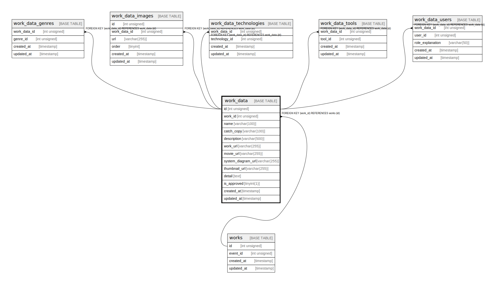

# work_data

## Description

<details>
<summary><strong>Table Definition</strong></summary>

```sql
CREATE TABLE `work_data` (
  `id` int unsigned NOT NULL AUTO_INCREMENT,
  `work_id` int unsigned NOT NULL,
  `name` varchar(100) COLLATE utf8mb4_general_ci NOT NULL,
  `catch_copy` varchar(100) COLLATE utf8mb4_general_ci NOT NULL,
  `description` varchar(500) COLLATE utf8mb4_general_ci NOT NULL,
  `work_url` varchar(255) COLLATE utf8mb4_general_ci DEFAULT NULL,
  `movie_url` varchar(255) COLLATE utf8mb4_general_ci DEFAULT NULL,
  `system_diagram_url` varchar(255) COLLATE utf8mb4_general_ci DEFAULT NULL,
  `thumbnail_url` varchar(255) COLLATE utf8mb4_general_ci DEFAULT NULL,
  `detail` text COLLATE utf8mb4_general_ci,
  `is_approved` tinyint(1) NOT NULL DEFAULT '0',
  `created_at` timestamp NULL DEFAULT CURRENT_TIMESTAMP,
  `updated_at` timestamp NULL DEFAULT CURRENT_TIMESTAMP ON UPDATE CURRENT_TIMESTAMP,
  PRIMARY KEY (`id`),
  KEY `Work_data_work_id_idx` (`work_id`),
  CONSTRAINT `Work_data_work_id_fkey` FOREIGN KEY (`work_id`) REFERENCES `works` (`id`) ON DELETE RESTRICT ON UPDATE CASCADE
) ENGINE=InnoDB DEFAULT CHARSET=utf8mb4 COLLATE=utf8mb4_general_ci
```

</details>

## Columns

| Name | Type | Default | Nullable | Extra Definition | Children | Parents | Comment |
| ---- | ---- | ------- | -------- | ---------------- | -------- | ------- | ------- |
| id | int unsigned |  | false | auto_increment | [work_data_genres](work_data_genres.md) [work_data_images](work_data_images.md) [work_data_technologies](work_data_technologies.md) [work_data_tools](work_data_tools.md) [work_data_users](work_data_users.md) |  |  |
| work_id | int unsigned |  | false |  |  | [works](works.md) |  |
| name | varchar(100) |  | false |  |  |  |  |
| catch_copy | varchar(100) |  | false |  |  |  |  |
| description | varchar(500) |  | false |  |  |  |  |
| work_url | varchar(255) |  | true |  |  |  |  |
| movie_url | varchar(255) |  | true |  |  |  |  |
| system_diagram_url | varchar(255) |  | true |  |  |  |  |
| thumbnail_url | varchar(255) |  | true |  |  |  |  |
| detail | text |  | true |  |  |  |  |
| is_approved | tinyint(1) | 0 | false |  |  |  |  |
| created_at | timestamp | CURRENT_TIMESTAMP | true | DEFAULT_GENERATED |  |  |  |
| updated_at | timestamp | CURRENT_TIMESTAMP | true | DEFAULT_GENERATED on update CURRENT_TIMESTAMP |  |  |  |

## Constraints

| Name | Type | Definition |
| ---- | ---- | ---------- |
| PRIMARY | PRIMARY KEY | PRIMARY KEY (id) |
| Work_data_work_id_fkey | FOREIGN KEY | FOREIGN KEY (work_id) REFERENCES works (id) |

## Indexes

| Name | Definition |
| ---- | ---------- |
| Work_data_work_id_idx | KEY Work_data_work_id_idx (work_id) USING BTREE |
| PRIMARY | PRIMARY KEY (id) USING BTREE |

## Relations



---

> Generated by [tbls](https://github.com/k1LoW/tbls)
