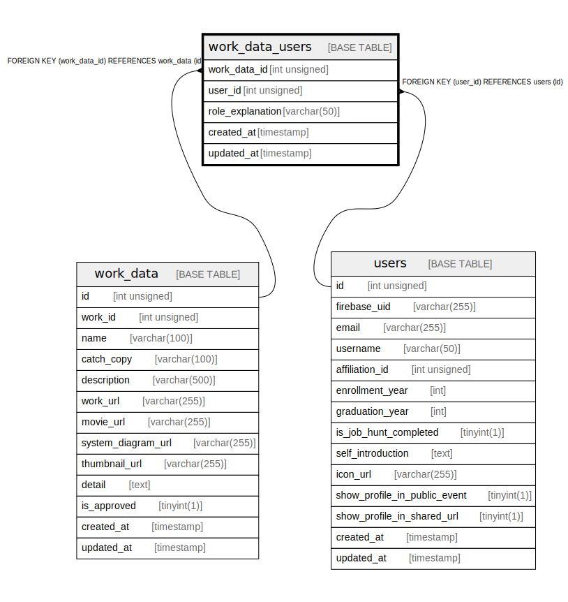

# work_data_users

## Description

<details>
<summary><strong>Table Definition</strong></summary>

```sql
CREATE TABLE `work_data_users` (
  `work_data_id` int unsigned NOT NULL,
  `user_id` int unsigned NOT NULL,
  `role_explanation` varchar(50) COLLATE utf8mb4_general_ci DEFAULT NULL,
  `created_at` timestamp NULL DEFAULT CURRENT_TIMESTAMP,
  `updated_at` timestamp NULL DEFAULT CURRENT_TIMESTAMP ON UPDATE CURRENT_TIMESTAMP,
  PRIMARY KEY (`work_data_id`,`user_id`),
  KEY `Work_data_user_user_id_idx` (`user_id`),
  KEY `Work_data_user_work_data_id_idx` (`work_data_id`),
  CONSTRAINT `Work_data_user_user_id_fkey` FOREIGN KEY (`user_id`) REFERENCES `users` (`id`) ON DELETE RESTRICT ON UPDATE CASCADE,
  CONSTRAINT `Work_data_user_work_data_id_fkey` FOREIGN KEY (`work_data_id`) REFERENCES `work_data` (`id`) ON DELETE RESTRICT ON UPDATE CASCADE
) ENGINE=InnoDB DEFAULT CHARSET=utf8mb4 COLLATE=utf8mb4_general_ci
```

</details>

## Columns

| Name | Type | Default | Nullable | Extra Definition | Children | Parents | Comment |
| ---- | ---- | ------- | -------- | ---------------- | -------- | ------- | ------- |
| work_data_id | int unsigned |  | false |  |  | [work_data](work_data.md) |  |
| user_id | int unsigned |  | false |  |  | [users](users.md) |  |
| role_explanation | varchar(50) |  | true |  |  |  |  |
| created_at | timestamp | CURRENT_TIMESTAMP | true | DEFAULT_GENERATED |  |  |  |
| updated_at | timestamp | CURRENT_TIMESTAMP | true | DEFAULT_GENERATED on update CURRENT_TIMESTAMP |  |  |  |

## Constraints

| Name | Type | Definition |
| ---- | ---- | ---------- |
| PRIMARY | PRIMARY KEY | PRIMARY KEY (work_data_id, user_id) |
| Work_data_user_user_id_fkey | FOREIGN KEY | FOREIGN KEY (user_id) REFERENCES users (id) |
| Work_data_user_work_data_id_fkey | FOREIGN KEY | FOREIGN KEY (work_data_id) REFERENCES work_data (id) |

## Indexes

| Name | Definition |
| ---- | ---------- |
| Work_data_user_user_id_idx | KEY Work_data_user_user_id_idx (user_id) USING BTREE |
| Work_data_user_work_data_id_idx | KEY Work_data_user_work_data_id_idx (work_data_id) USING BTREE |
| PRIMARY | PRIMARY KEY (work_data_id, user_id) USING BTREE |

## Relations



---

> Generated by [tbls](https://github.com/k1LoW/tbls)
